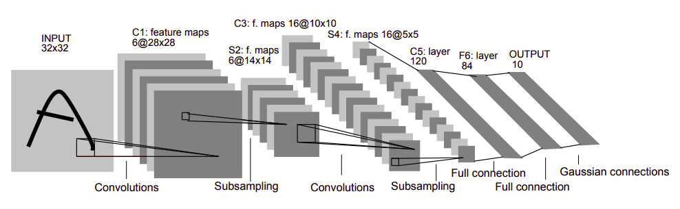

# LeNet5
Implementation  of LeNet5 architecture.

---
## About
LeNet5 was the first convolution neural network architecture proposed by yann le cun in 1989. This classical architecture is  inspiration of latest architectures.

## Architecture

Its architecture is simple, yet powerful. It has input size of (32,32) and going, it follows convolution, Pooling and non-linear.
Description as Below:

1. Every convolutional layer includes three parts: convolution, pooling, and nonlinear activation functions
2. Using convolution to extract spatial features (Convolution was called receptive fields originally)
3. Subsampling average pooling layer
4. tanh activation function
5. Using MLP as the last classifier
6. Sparse connection between layers to reduce the complexity of computational

*Note This is modern Implementation of LeNet unlike from paper, reducing complexities.*

## Structure

`Input(1, 32,32) => Convolution(6,28,28) => pool(6,14,14) => Convolution(16,10,10) => pool(16,5,5) => Linear(120) => Linear(84) => Output(10)`

## Results
Here is my results experimenting on mnist handwritten dataset on LeNet architecture.

#### Learning_rate decays on different activations and pools
---
|Learning_rate       |Training_accuracy|Testing_accuracy|Activation                                                      |pool          |
|--------------------|-----------------|----------------|----------------------------------------------------------------|--------------|
|0.0125              |97.7824          |98.01           |['relu', 'relu', 'rrelu', 'rrelu', 'celu']                      |('max', 'avg')|
|0.0125              |97.5826          |98.01           |['relu', 'relu', 'relu', 'rrelu', 'rrelu']                      |('max', 'max')|
|0.016666666666666666|97.215           |98.02           |['relu', 'relu', 'rrelu', 'rrelu', 'rrelu']                     |('max', 'max')|
|0.0125              |97.7946          |98.03           |['relu', 'relu', 'rrelu', 'celu', 'celu']                       |('avg', 'avg')|
|0.016666666666666666|97.7642          |98.04           |['relu', 'leaky_relu', 'leaky_relu', 'celu', 'celu']            |('max', 'max')|
|0.018182            |97.6352          |98.04           |['relu', 'rrelu', 'leaky_relu', 'leaky_relu', 'celu']           |('max', 'avg')|
|0.016666666666666666|97.7912          |98.04           |['leaky_relu', 'leaky_relu', 'celu', 'celu', 'celu']            |('max', 'avg')|
|0.014285714285714284|97.5784          |98.06           |['relu', 'relu', 'relu', 'rrelu', 'rrelu']                      |('max', 'max')|
|0.018181818181818184|97.4964          |98.06           |['relu', 'rrelu', 'leaky_relu', 'celu', 'celu']                 |('max', 'avg')|
|0.013333333333333334|97.7666          |98.06           |['relu', 'relu', 'leaky_relu', 'celu', 'celu']                  |('max', 'max')|
|0.011764705882352941|97.5692          |98.07           |['rrelu', 'leaky_relu', 'leaky_relu', 'leaky_relu', 'celu']     |('avg', 'avg')|
|0.015384615384615384|97.7434          |98.09           |['leaky_relu', 'leaky_relu', 'leaky_relu', 'celu', 'celu']      |('avg', 'avg')|
|0.018181818181818184|97.6754          |98.09           |['leaky_relu', 'leaky_relu', 'leaky_relu', 'celu', 'celu']      |('max', 'avg')|
|0.018182            |97.745           |98.09           |['leaky_relu', 'leaky_relu', 'leaky_relu', 'celu', 'celu']      |('max', 'max')|
|0.018182            |96.6006          |98.11           |['relu', 'relu', 'leaky_relu', 'leaky_relu', 'leaky_relu']      |('max', 'max')|
|0.011764705882352941|97.5882          |98.12           |['relu', 'relu', 'leaky_relu', 'leaky_relu', 'celu']            |('max', 'max')|
|0.015384615384615384|97.0372          |98.12           |['relu', 'relu', 'rrelu', 'leaky_relu', 'leaky_relu']           |('avg', 'avg')|
|0.013333333333333334|96.3234          |98.12           |['relu', 'leaky_relu', 'leaky_relu', 'leaky_relu', 'leaky_relu']|('avg', 'avg')|
|0.0125              |98.03            |98.12           |['leaky_relu', 'leaky_relu', 'leaky_relu', 'celu', 'celu']      |('max', 'avg')|
|0.011111111111111113|97.2278          |98.12           |['relu', 'relu', 'rrelu', 'celu', 'celu']                       |('max', 'avg')|
|0.011764705882352941|97.6024          |98.14           |['relu', 'relu', 'rrelu', 'celu', 'celu']                       |('avg', 'avg')|
|0.016666666666666666|97.6132          |98.15           |['leaky_relu', 'leaky_relu', 'leaky_relu', 'leaky_relu', 'celu']|('max', 'max')|
|0.014285714285714284|97.5058          |98.15           |['relu', 'relu', 'rrelu', 'leaky_relu', 'celu']                 |('max', 'avg')|
|0.013333333333333334|97.9202          |98.16           |['relu', 'leaky_relu', 'leaky_relu', 'celu', 'celu']            |('max', 'max')|
|0.013333333333333334|98.0346          |98.16           |['relu', 'relu', 'relu', 'celu', 'celu']                        |('max', 'max')|
|0.014285714285714284|97.4876          |98.17           |['relu', 'relu', 'leaky_relu', 'leaky_relu', 'leaky_relu']      |('max', 'max')|
|0.014285714285714284|97.0066          |98.18           |['rrelu', 'leaky_relu', 'leaky_relu', 'leaky_relu', 'celu']     |('max', 'avg')|
|0.0125              |97.5624          |98.18           |['relu', 'relu', 'relu', 'rrelu', 'leaky_relu']                 |('max', 'max')|
|0.010526315789473684|97.1532          |98.19           |['relu', 'relu', 'relu', 'leaky_relu', 'leaky_relu']            |('max', 'max')|
|0.016666666666666666|97.4152          |98.19           |['relu', 'rrelu', 'leaky_relu', 'leaky_relu', 'celu']           |('max', 'avg')|
|0.0125              |97.4818          |98.2            |['relu', 'relu', 'relu', 'rrelu', 'celu']                       |('max', 'max')|
|0.011764705882352941|97.4006          |98.21           |['relu', 'relu', 'relu', 'rrelu', 'rrelu']                      |('max', 'max')|
|0.011111111111111113|97.4908          |98.22           |['relu', 'relu', 'relu', 'celu', 'celu']                        |('max', 'max')|
|0.015384615384615384|96.8774          |98.22           |['relu', 'relu', 'relu', 'leaky_relu', 'leaky_relu']            |('max', 'max')|
|0.011764705882352941|97.4326          |98.22           |['relu', 'relu', 'relu', 'relu', 'celu']                        |('max', 'max')|
|0.018181818181818184|97.6932          |98.22           |['relu', 'relu', 'relu', 'celu', 'celu']                        |('max', 'avg')|
|0.011764705882352941|97.0998          |98.22           |['relu', 'relu', 'rrelu', 'rrelu', 'celu']                      |('max', 'avg')|
|0.015384615384615384|97.3576          |98.23           |['relu', 'relu', 'relu', 'celu', 'celu']                        |('max', 'avg')|
|0.014285714285714284|97.5902          |98.23           |['relu', 'relu', 'rrelu', 'rrelu', 'rrelu']                     |('max', 'avg')|
|0.016666666666666666|97.73100000000001|98.23           |['relu', 'leaky_relu', 'celu', 'celu', 'celu']                  |('max', 'avg')|
|0.018181818181818184|97.4338          |98.23           |['relu', 'relu', 'relu', 'rrelu', 'leaky_relu']                 |('avg', 'avg')|
|0.010526315789473684|97.37700000000001|98.24           |['relu', 'relu', 'rrelu', 'leaky_relu', 'leaky_relu']           |('max', 'max')|
|0.018182            |97.529           |98.24           |['relu', 'leaky_relu', 'leaky_relu', 'leaky_relu', 'celu']      |('max', 'avg')|
|0.011764705882352941|97.86            |98.25           |['relu', 'leaky_relu', 'celu', 'celu', 'celu']                  |('avg', 'avg')|
|0.011111111111111113|97.969           |98.25           |['relu', 'relu', 'rrelu', 'leaky_relu', 'celu']                 |('max', 'max')|
|0.011111111111111113|98.0168          |98.25           |['relu', 'relu', 'celu', 'celu', 'celu']                        |('max', 'max')|
|0.013333333333333334|97.5208          |98.25           |['relu', 'relu', 'rrelu', 'rrelu', 'celu']                      |('avg', 'avg')|
|0.010526315789473684|97.8024          |98.25           |['relu', 'relu', 'relu', 'celu', 'celu']                        |('max', 'max')|
|0.015384615384615384|96.70700000000001|98.25           |['relu', 'leaky_relu', 'leaky_relu', 'leaky_relu', 'celu']      |('max', 'avg')|
|0.014285714285714284|97.6148          |98.25           |['relu', 'relu', 'rrelu', 'celu', 'celu']                       |('avg', 'avg')|
|0.0125              |97.3686          |98.25           |['relu', 'relu', 'relu', 'leaky_relu', 'leaky_relu']            |('max', 'max')|
|0.014285714285714284|97.8084          |98.26           |['relu', 'leaky_relu', 'leaky_relu', 'celu', 'celu']            |('max', 'avg')|
|0.016666666666666666|97.4586          |98.27           |['relu', 'leaky_relu', 'leaky_relu', 'leaky_relu', 'celu']      |('avg', 'avg')|
|0.018181818181818184|95.8018          |98.27           |['relu', 'relu', 'relu', 'relu', 'leaky_relu']                  |('max', 'avg')|
|0.018181818181818184|96.9082          |98.27           |['relu', 'relu', 'leaky_relu', 'leaky_relu', 'leaky_relu']      |('avg', 'avg')|
|0.016666666666666666|97.4462          |98.27           |['relu', 'relu', 'relu', 'rrelu', 'rrelu']                      |('max', 'avg')|
|0.015384615384615384|97.2928          |98.28           |['relu', 'relu', 'relu', 'relu', 'rrelu']                       |('max', 'max')|
|0.011111111111111113|97.3948          |98.28           |['relu', 'relu', 'rrelu', 'rrelu', 'rrelu']                     |('avg', 'avg')|
|0.015384615384615384|97.611           |98.28           |['relu', 'relu', 'rrelu', 'rrelu', 'rrelu']                     |('avg', 'avg')|
|0.011111111111111113|97.4628          |98.28           |['relu', 'rrelu', 'leaky_relu', 'leaky_relu', 'celu']           |('avg', 'avg')|
|0.010526315789473684|97.3632          |98.29           |['relu', 'relu', 'rrelu', 'leaky_relu', 'celu']                 |('avg', 'avg')|
|0.018182            |97.5284          |98.29           |['relu', 'relu', 'relu', 'rrelu', 'celu']                       |('avg', 'avg')|
|0.018181818181818184|97.7094          |98.29           |['relu', 'leaky_relu', 'leaky_relu', 'celu', 'celu']            |('avg', 'avg')|
|0.015384615384615384|97.15799999999999|98.3            |['relu', 'leaky_relu', 'leaky_relu', 'leaky_relu', 'leaky_relu']|('avg', 'avg')|
|0.010526315789473684|97.9598          |98.3            |['relu', 'leaky_relu', 'celu', 'celu', 'celu']                  |('max', 'max')|
|0.013333333333333334|97.3736          |98.31           |['relu', 'relu', 'relu', 'relu', 'rrelu']                       |('max', 'max')|
|0.016666666666666666|97.5098          |98.31           |['leaky_relu', 'leaky_relu', 'leaky_relu', 'celu', 'celu']      |('max', 'avg')|
|0.014285714285714284|97.8698          |98.32           |['leaky_relu', 'leaky_relu', 'leaky_relu', 'celu', 'celu']      |('max', 'max')|
|0.011111111111111113|97.8436          |98.32           |['relu', 'relu', 'leaky_relu', 'celu', 'celu']                  |('max', 'avg')|
|0.016666666666666666|97.2918          |98.32           |['relu', 'relu', 'rrelu', 'celu', 'celu']                       |('avg', 'avg')|
|0.011111111111111113|97.7168          |98.33           |['leaky_relu', 'leaky_relu', 'celu', 'celu', 'celu']            |('avg', 'avg')|
|0.016666666666666666|97.1766          |98.33           |['relu', 'relu', 'leaky_relu', 'leaky_relu', 'leaky_relu']      |('avg', 'avg')|
|0.013333333333333334|97.7106          |98.33           |['leaky_relu', 'leaky_relu', 'celu', 'celu', 'celu']            |('max', 'max')|
|0.0125              |96.7348          |98.34           |['relu', 'leaky_relu', 'leaky_relu', 'leaky_relu', 'leaky_relu']|('max', 'max')|
|0.018181818181818184|97.5382          |98.35           |['relu', 'relu', 'rrelu', 'rrelu', 'celu']                      |('avg', 'avg')|
|0.018182            |97.741           |98.35           |['relu', 'relu', 'relu', 'celu', 'celu']                        |('max', 'avg')|
|0.011111111111111113|97.3914          |98.35           |['relu', 'relu', 'rrelu', 'rrelu', 'leaky_relu']                |('avg', 'avg')|
|0.016666666666666666|97.7662          |98.35           |['relu', 'relu', 'relu', 'rrelu', 'celu']                       |('max', 'avg')|
|0.011764705882352941|97.7656          |98.35           |['relu', 'relu', 'leaky_relu', 'celu', 'celu']                  |('avg', 'avg')|
|0.011764705882352941|97.6148          |98.36           |['relu', 'relu', 'relu', 'rrelu', 'celu']                       |('max', 'max')|
|0.014285714285714284|97.8202          |98.36           |['relu', 'relu', 'leaky_relu', 'leaky_relu', 'celu']            |('max', 'max')|
|0.011111111111111113|97.3832          |98.36           |['relu', 'relu', 'relu', 'rrelu', 'leaky_relu']                 |('max', 'max')|
|0.015384615384615384|97.9658          |98.36           |['relu', 'relu', 'leaky_relu', 'celu', 'celu']                  |('avg', 'avg')|
|0.013333333333333334|97.7518          |98.36           |['relu', 'relu', 'rrelu', 'celu', 'celu']                       |('avg', 'avg')|
|0.015384615384615384|97.0394          |98.36           |['relu', 'relu', 'rrelu', 'rrelu', 'leaky_relu']                |('avg', 'avg')|
|0.013333333333333334|96.7548          |98.37           |['relu', 'relu', 'relu', 'rrelu', 'leaky_relu']                 |('max', 'avg')|
|0.018182            |97.7518          |98.37           |['leaky_relu', 'leaky_relu', 'leaky_relu', 'leaky_relu', 'celu']|('avg', 'avg')|
|0.014285714285714284|97.2242          |98.38           |['relu', 'relu', 'relu', 'relu', 'leaky_relu']                  |('avg', 'avg')|
|0.018182            |97.8068          |98.39           |['relu', 'leaky_relu', 'leaky_relu', 'celu', 'celu']            |('avg', 'avg')|
|0.018182            |97.40700000000001|98.39           |['relu', 'relu', 'rrelu', 'rrelu', 'rrelu']                     |('avg', 'avg')|
|0.013333333333333334|96.9812          |98.39           |['relu', 'relu', 'relu', 'relu', 'leaky_relu']                  |('max', 'avg')|
|0.013333333333333334|96.8852          |98.4            |['relu', 'relu', 'relu', 'leaky_relu', 'celu']                  |('max', 'avg')|
|0.018182            |97.5956          |98.4            |['relu', 'relu', 'relu', 'leaky_relu', 'celu']                  |('max', 'avg')|
|0.015384615384615384|97.0218          |98.4            |['relu', 'relu', 'relu', 'leaky_relu', 'celu']                  |('avg', 'avg')|
|0.018181818181818184|97.3912          |98.4            |['relu', 'relu', 'rrelu', 'leaky_relu', 'celu']                 |('max', 'max')|
|0.014285714285714284|97.2736          |98.4            |['relu', 'relu', 'rrelu', 'leaky_relu', 'leaky_relu']           |('max', 'max')|
|0.016666666666666666|96.5036          |98.4            |['relu', 'relu', 'relu', 'celu', 'celu']                        |('max', 'avg')|
|0.011764705882352941|97.7742          |98.4            |['relu', 'leaky_relu', 'leaky_relu', 'celu', 'celu']            |('avg', 'avg')|
|0.010526315789473684|97.8636          |98.41           |['relu', 'relu', 'rrelu', 'rrelu', 'rrelu']                     |('max', 'max')|
|0.018182            |96.5942          |98.43           |['relu', 'relu', 'relu', 'relu', 'rrelu']                       |('max', 'avg')|
|0.010526315789473684|97.2974          |98.43           |['relu', 'relu', 'relu', 'rrelu', 'leaky_relu']                 |('max', 'max')|
|0.010526315789473684|97.5258          |98.43           |['relu', 'relu', 'relu', 'relu', 'rrelu']                       |('max', 'avg')|
|0.013333333333333334|97.69200000000001|98.43           |['leaky_relu', 'leaky_relu', 'leaky_relu', 'leaky_relu', 'celu']|('max', 'avg')|
|0.011764705882352941|97.6214          |98.44           |['relu', 'relu', 'rrelu', 'leaky_relu', 'celu']                 |('avg', 'avg')|
|0.011111111111111113|97.9746          |98.44           |['leaky_relu', 'leaky_relu', 'leaky_relu', 'celu', 'celu']      |('avg', 'avg')|
|0.011764705882352941|97.2556          |98.44           |['relu', 'relu', 'rrelu', 'leaky_relu', 'leaky_relu']           |('max', 'max')|
|0.0125              |97.3074          |98.45           |['leaky_relu', 'leaky_relu', 'leaky_relu', 'leaky_relu', 'celu']|('max', 'avg')|
|0.018182            |97.6374          |98.45           |['relu', 'relu', 'rrelu', 'celu', 'celu']                       |('avg', 'avg')|
|0.010526315789473684|97.72200000000001|98.45           |['relu', 'leaky_relu', 'leaky_relu', 'celu', 'celu']            |('avg', 'avg')|
|0.011111111111111113|97.5166          |98.47           |['relu', 'relu', 'rrelu', 'rrelu', 'celu']                      |('avg', 'avg')|
|0.011111111111111113|97.6082          |98.47           |['relu', 'relu', 'relu', 'rrelu', 'celu']                       |('max', 'avg')|
|0.016666666666666666|97.3554          |98.47           |['relu', 'leaky_relu', 'leaky_relu', 'leaky_relu', 'leaky_relu']|('max', 'avg')|
|0.018182            |97.6726          |98.47           |['relu', 'relu', 'leaky_relu', 'leaky_relu', 'celu']            |('avg', 'avg')|
|0.011111111111111113|97.8514          |98.48           |['relu', 'relu', 'leaky_relu', 'leaky_relu', 'celu']            |('max', 'max')|
|0.0125              |97.2838          |98.49           |['relu', 'relu', 'rrelu', 'leaky_relu', 'leaky_relu']           |('max', 'max')|
|0.010526315789473684|97.9654          |98.49           |['leaky_relu', 'leaky_relu', 'leaky_relu', 'celu', 'celu']      |('max', 'max')|
|0.0125              |97.2976          |98.49           |['relu', 'relu', 'relu', 'relu', 'leaky_relu']                  |('avg', 'avg')|
|0.010526315789473684|97.6576          |98.5            |['relu', 'leaky_relu', 'leaky_relu', 'leaky_relu', 'celu']      |('max', 'avg')|
|0.015384615384615384|97.7592          |98.5            |['relu', 'leaky_relu', 'leaky_relu', 'celu', 'celu']            |('avg', 'avg')|
|0.010526315789473684|97.7068          |98.5            |['leaky_relu', 'leaky_relu', 'leaky_relu', 'leaky_relu', 'celu']|('max', 'max')|
|0.010526315789473684|97.4974          |98.51           |['relu', 'relu', 'relu', 'leaky_relu', 'celu']                  |('max', 'avg')|
|0.013333333333333334|97.736           |98.51           |['relu', 'relu', 'relu', 'relu', 'celu']                        |('max', 'avg')|
|0.010526315789473684|97.381           |98.52           |['relu', 'relu', 'rrelu', 'rrelu', 'celu']                      |('max', 'avg')|
|0.016666666666666666|97.5232          |98.52           |['relu', 'relu', 'relu', 'relu', 'celu']                        |('max', 'max')|
|0.014285714285714284|97.6002          |98.52           |['relu', 'relu', 'relu', 'celu', 'celu']                        |('avg', 'avg')|
|0.0125              |97.4254          |98.53           |['relu', 'relu', 'leaky_relu', 'leaky_relu', 'leaky_relu']      |('max', 'avg')|
|0.018181818181818184|96.635           |98.53           |['relu', 'relu', 'relu', 'leaky_relu', 'leaky_relu']            |('max', 'avg')|
|0.013333333333333334|97.8768          |98.53           |['relu', 'relu', 'leaky_relu', 'leaky_relu', 'celu']            |('avg', 'avg')|
|0.014285714285714284|97.4294          |98.54           |['relu', 'leaky_relu', 'leaky_relu', 'leaky_relu', 'celu']      |('max', 'avg')|
|0.016666666666666666|97.1206          |98.54           |['relu', 'relu', 'relu', 'relu', 'leaky_relu']                  |('max', 'max')|
|0.018181818181818184|97.3822          |98.55           |['relu', 'leaky_relu', 'leaky_relu', 'leaky_relu', 'leaky_relu']|('avg', 'avg')|
|0.018181818181818184|97.3068          |98.55           |['leaky_relu', 'leaky_relu', 'leaky_relu', 'leaky_relu', 'celu']|('avg', 'avg')|
|0.014285714285714284|98.0324          |98.56           |['leaky_relu', 'leaky_relu', 'leaky_relu', 'leaky_relu', 'celu']|('max', 'max')|
|0.018181818181818184|97.917           |98.56           |['relu', 'relu', 'leaky_relu', 'celu', 'celu']                  |('avg', 'avg')|
|0.018181818181818184|97.3358          |98.56           |['relu', 'relu', 'relu', 'relu', 'rrelu']                       |('max', 'avg')|
|0.013333333333333334|97.05            |98.56           |['relu', 'relu', 'leaky_relu', 'leaky_relu', 'leaky_relu']      |('avg', 'avg')|
|0.014285714285714284|96.7652          |98.56           |['relu', 'relu', 'relu', 'rrelu', 'leaky_relu']                 |('avg', 'avg')|
|0.011764705882352941|97.3092          |98.56           |['leaky_relu', 'leaky_relu', 'leaky_relu', 'leaky_relu', 'celu']|('avg', 'avg')|
|0.011764705882352941|97.5684          |98.57           |['relu', 'leaky_relu', 'leaky_relu', 'leaky_relu', 'leaky_relu']|('max', 'avg')|
|0.018182            |97.3394          |98.58           |['relu', 'leaky_relu', 'leaky_relu', 'leaky_relu', 'leaky_relu']|('max', 'avg')|
|0.0125              |97.9068          |98.58           |['relu', 'relu', 'leaky_relu', 'celu', 'celu']                  |('max', 'max')|
|0.011111111111111113|97.2584          |98.58           |['relu', 'relu', 'relu', 'relu', 'leaky_relu']                  |('max', 'max')|
|0.014285714285714284|97.6882          |98.58           |['relu', 'relu', 'relu', 'rrelu', 'celu']                       |('avg', 'avg')|
|0.010526315789473684|97.6824          |98.58           |['relu', 'relu', 'leaky_relu', 'celu', 'celu']                  |('max', 'max')|
|0.015384615384615384|97.5728          |98.59           |['relu', 'relu', 'relu', 'relu', 'celu']                        |('avg', 'avg')|
|0.015384615384615384|97.1706          |98.59           |['relu', 'relu', 'relu', 'rrelu', 'celu']                       |('avg', 'avg')|
|0.010526315789473684|97.3098          |98.6            |['relu', 'relu', 'relu', 'relu', 'leaky_relu']                  |('avg', 'avg')|
|0.015384615384615384|97.1118          |98.6            |['relu', 'relu', 'leaky_relu', 'leaky_relu', 'leaky_relu']      |('max', 'avg')|
|0.013333333333333334|97.3398          |98.6            |['relu', 'relu', 'relu', 'rrelu', 'celu']                       |('avg', 'avg')|
|0.018182            |97.473           |98.6            |['relu', 'relu', 'relu', 'relu', 'celu']                        |('avg', 'avg')|
|0.010526315789473684|97.8462          |98.6            |['relu', 'relu', 'leaky_relu', 'leaky_relu', 'celu']            |('max', 'max')|
|0.011764705882352941|96.897           |98.61           |['relu', 'relu', 'relu', 'leaky_relu', 'leaky_relu']            |('avg', 'avg')|
|0.013333333333333334|97.571           |98.61           |['relu', 'relu', 'rrelu', 'leaky_relu', 'celu']                 |('avg', 'avg')|
|0.018182            |96.9892          |98.61           |['relu', 'relu', 'relu', 'leaky_relu', 'leaky_relu']            |('max', 'avg')|
|0.0125              |97.8628          |98.61           |['relu', 'leaky_relu', 'leaky_relu', 'celu', 'celu']            |('max', 'avg')|
|0.013333333333333334|97.5056          |98.63           |['relu', 'relu', 'rrelu', 'rrelu', 'leaky_relu']                |('avg', 'avg')|
|0.016666666666666666|97.5912          |98.64           |['relu', 'relu', 'leaky_relu', 'leaky_relu', 'celu']            |('avg', 'avg')|
|0.014285714285714284|97.5344          |98.64           |['relu', 'relu', 'relu', 'leaky_relu', 'celu']                  |('max', 'max')|
|0.011111111111111113|97.6932          |98.64           |['relu', 'relu', 'relu', 'rrelu', 'rrelu']                      |('max', 'max')|
|0.011111111111111113|97.4956          |98.64           |['relu', 'leaky_relu', 'leaky_relu', 'leaky_relu', 'leaky_relu']|('max', 'max')|
|0.018181818181818184|97.682           |98.65           |['relu', 'relu', 'relu', 'relu', 'celu']                        |('max', 'avg')|
|0.011111111111111113|97.0186          |98.65           |['relu', 'relu', 'relu', 'relu', 'rrelu']                       |('max', 'avg')|
|0.013333333333333334|97.0034          |98.66           |['relu', 'relu', 'relu', 'rrelu', 'rrelu']                      |('avg', 'avg')|
|0.0125              |97.8354          |98.67           |['relu', 'relu', 'relu', 'celu', 'celu']                        |('avg', 'avg')|
|0.011764705882352941|97.6368          |98.67           |['relu', 'relu', 'relu', 'celu', 'celu']                        |('max', 'avg')|
|0.010526315789473684|97.7128          |98.67           |['relu', 'leaky_relu', 'leaky_relu', 'leaky_relu', 'leaky_relu']|('max', 'max')|
|0.0125              |97.4706          |98.68           |['relu', 'relu', 'relu', 'relu', 'rrelu']                       |('avg', 'avg')|
|0.011111111111111113|97.3764          |98.69           |['relu', 'relu', 'relu', 'leaky_relu', 'leaky_relu']            |('avg', 'avg')|
|0.011764705882352941|96.9916          |98.7            |['relu', 'relu', 'leaky_relu', 'leaky_relu', 'leaky_relu']      |('avg', 'avg')|
|0.014285714285714284|97.4116          |98.7            |['relu', 'relu', 'relu', 'leaky_relu', 'leaky_relu']            |('max', 'avg')|
|0.014285714285714284|97.8564          |98.7            |['relu', 'relu', 'leaky_relu', 'celu', 'celu']                  |('avg', 'avg')|
|0.0125              |97.5842          |98.7            |['relu', 'relu', 'relu', 'relu', 'celu']                        |('max', 'avg')|
|0.011111111111111113|98.0014          |98.7            |['relu', 'leaky_relu', 'leaky_relu', 'celu', 'celu']            |('max', 'max')|
|0.011111111111111113|97.8834          |98.71           |['relu', 'relu', 'leaky_relu', 'leaky_relu', 'leaky_relu']      |('max', 'max')|
|0.011764705882352941|97.7732          |98.72           |['relu', 'leaky_relu', 'leaky_relu', 'leaky_relu', 'celu']      |('max', 'max')|
|0.014285714285714284|97.5182          |98.73           |['relu', 'relu', 'relu', 'relu', 'rrelu']                       |('avg', 'avg')|
|0.015384615384615384|97.875           |98.73           |['relu', 'relu', 'leaky_relu', 'leaky_relu', 'celu']            |('avg', 'avg')|
|0.015384615384615384|97.5498          |98.73           |['leaky_relu', 'leaky_relu', 'leaky_relu', 'leaky_relu', 'celu']|('max', 'avg')|
|0.011764705882352941|97.2934          |98.74           |['relu', 'relu', 'relu', 'relu', 'rrelu']                       |('max', 'max')|
|0.016666666666666666|96.3126          |98.75           |['relu', 'relu', 'relu', 'leaky_relu', 'leaky_relu']            |('avg', 'avg')|
|0.014285714285714284|97.4358          |98.76           |['relu', 'leaky_relu', 'leaky_relu', 'leaky_relu', 'leaky_relu']|('avg', 'avg')|
|0.011111111111111113|97.2132          |98.76           |['relu', 'leaky_relu', 'leaky_relu', 'leaky_relu', 'celu']      |('avg', 'avg')|
|0.0125              |97.541           |98.76           |['relu', 'leaky_relu', 'leaky_relu', 'leaky_relu', 'celu']      |('max', 'avg')|
|0.011111111111111113|96.9734          |98.76           |['relu', 'relu', 'relu', 'leaky_relu', 'celu']                  |('max', 'avg')|
|0.010526315789473684|97.5264          |98.77           |['relu', 'relu', 'relu', 'rrelu', 'rrelu']                      |('avg', 'avg')|
|0.0125              |97.3378          |98.77           |['relu', 'relu', 'relu', 'leaky_relu', 'celu']                  |('max', 'max')|
|0.010526315789473684|97.0332          |98.78           |['relu', 'relu', 'relu', 'relu', 'celu']                        |('avg', 'avg')|
|0.0125              |97.2668          |98.78           |['relu', 'relu', 'leaky_relu', 'leaky_relu', 'celu']            |('max', 'avg')|
|0.011111111111111113|97.6022          |98.79           |['leaky_relu', 'leaky_relu', 'leaky_relu', 'leaky_relu', 'celu']|('avg', 'avg')|
|0.016666666666666666|97.3064          |98.79           |['relu', 'relu', 'relu', 'leaky_relu', 'celu']                  |('max', 'avg')|
|0.013333333333333334|97.7148          |98.81           |['relu', 'leaky_relu', 'leaky_relu', 'leaky_relu', 'celu']      |('max', 'avg')|
|0.014285714285714284|97.6368          |98.81           |['relu', 'relu', 'relu', 'relu', 'celu']                        |('max', 'avg')|
|0.011764705882352941|97.2422          |98.83           |['relu', 'relu', 'relu', 'relu', 'leaky_relu']                  |('avg', 'avg')|
|0.016666666666666666|97.0516          |98.83           |['relu', 'relu', 'relu', 'relu', 'rrelu']                       |('avg', 'avg')|
|0.011764705882352941|97.7154          |98.85           |['relu', 'relu', 'rrelu', 'rrelu', 'rrelu']                     |('avg', 'avg')|
|0.010526315789473684|97.32            |98.87           |['relu', 'relu', 'leaky_relu', 'leaky_relu', 'leaky_relu']      |('max', 'avg')|
|0.011764705882352941|97.6502          |98.87           |['relu', 'relu', 'relu', 'rrelu', 'leaky_relu']                 |('avg', 'avg')|
|0.013333333333333334|97.4002          |98.87           |['relu', 'relu', 'relu', 'leaky_relu', 'leaky_relu']            |('avg', 'avg')|
|0.011111111111111113|97.46            |98.88           |['relu', 'relu', 'relu', 'relu', 'celu']                        |('max', 'avg')|
|0.015384615384615384|97.2978          |98.89           |['relu', 'relu', 'relu', 'relu', 'leaky_relu']                  |('avg', 'avg')|
|0.010526315789473684|97.758           |98.89           |['relu', 'relu', 'relu', 'rrelu', 'celu']                       |('max', 'avg')|
|0.011764705882352941|97.56700000000001|98.92           |['relu', 'relu', 'relu', 'leaky_relu', 'celu']                  |('max', 'max')|

---

### References
- [LeNet5 Wiki](https://en.wikipedia.org/wiki/LeNet)
- [LeNet Paper](http://yann.lecun.com/exdb/publis/pdf/lecun-01a.pdf)
- Finally, Thanks to andrew ng lecture.
